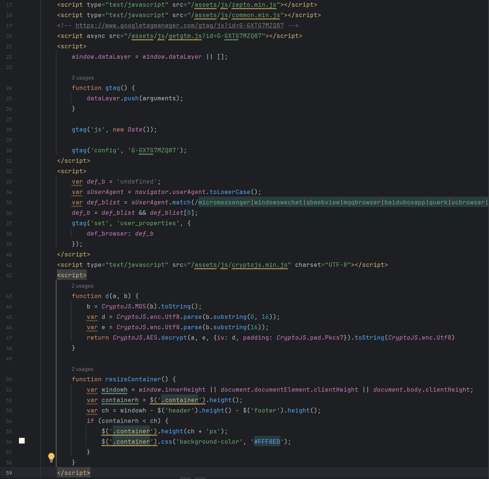

# 页面分析

## 初步了解

1、只能手机浏览器访问，否则会跳到其他页面

2、页面编码要改成resp.encoding='utf-8'

3、第一第二解决之后出现的问题是，小说内容只加载了前几段，怀疑后面的内容是js生成的，第一反应是js请求之后放入到html中。当前已经获取到了前几段的html，并能够使用PC浏览器打开静态html。

下一步是找出到底是哪一个js生成了后续的小说内容。

查看html内容，找到会执行哪些js代码或js文件。

html开头给出了这几个scripts

目标，找出到底是哪里对文本进行了解密，或者加密