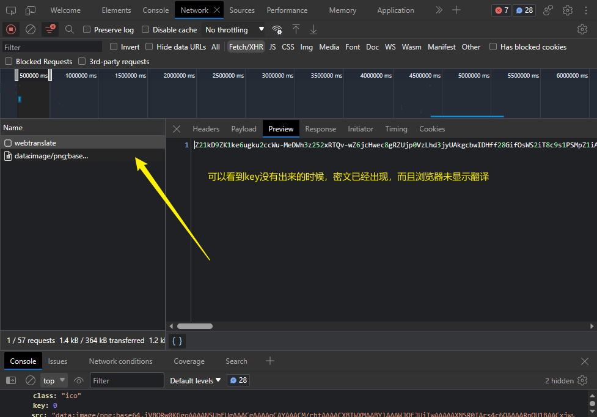
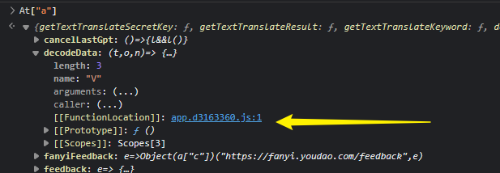

# 有道翻译

## sign签名


刷新页面重新请求数据包


这里可以知道sign是使用md5加密


经过测试，这是一个标准的md5加密


请求成功

## 密文解密



所以，我们需要定位到密文解码的大概位置，或者解密的大概时间


根据顺序栈，找到具体js文件，添加断点，重新执行，找到解密代码


向前找解密代码（虽然浏览器仍然没有显示翻译结果）


发现解密代码

分析：


验证：key和iv是不变的

At["a"]包含解码函数decodeData，参数为o, si["a"].state.text.decodeKey, si["a"].state.text.decodeIv

进入decodeData查看具体代码




解析：

这段代码实现了一个AES 128位CBC模式的解密函数V:

1. 检查参数t是否存在,如果不存在返回null
2. 使用key o和iv n生成两个16字节的缓冲区a和c
3. 创建一个AES-128-CBC解密器i,使用key a和iv c初始化
4. 使用i对输入的base64编码的密文t进行解密,输出utf-8格式的明文
5. 将解密结果的不同部分组合成字符串s并返回

所以这个V函数接收了一个base64编码的密文t,以及key和iv,使用AES-128-CBC算法解密t,并返回解密后的明文字符串。

这个是典型的AES加密算法的使用,传入key和iv生成解密器,然后分块解密密文,组合明文后返回。iv通常用于增加随机性,避免重复的明密文对应。


此处发现并没有对值进行修改


最后将解密出来的字符串拼接成s

## 小bug


### 编码错误

我的问题非常奇怪，第一次调用

```python
with open('sign.js', mode='r', encoding='utf-8') as f:
    js_file = f.read()

js_code = execjs.compile(js_file)  # 编译js
time_stamp = int(time.time()*1000)
sign = js_code.call('A', time_stamp)  # 传入time_stamp
print('sign ==>', sign)
```

sign是可以运行出来的，但是

```python
resp = requests.post(url=url, headers=headers, params=data).text
print(resp)
text = js_code.call('decrypt', resp)  # 传入密文
print(text)
```

```powershell
Exception in thread Thread-3:
Traceback (most recent call last):
  File "C:\Users\24613\anaconda3\lib\threading.py", line 980, in _bootstrap_inner
    self.run()
  File "C:\Users\24613\anaconda3\lib\threading.py", line 917, in run
    self._target(*self._args, **self._kwargs)
  File "C:\Users\24613\anaconda3\lib\subprocess.py", line 1479, in _readerthread
    buffer.append(fh.read())
UnicodeDecodeError: 'gbk' codec can't decode byte 0xaf in position 323: illegal multibyte sequence
Traceback (most recent call last):
  File "D:\Programs\爬虫\js逆向\有道翻译\有道翻译.py", line 69, in <module>
    text = js_code.call('decrypt', resp)  # 传入密文
```

应该是第二段代码有不支持的地方

[execjs执行js编码错误的解决方法（UnicodeDecodeError: ‘gbk‘ codec can‘t decode byte 0xad in position 20: illegal ） - Acheng1011 - 博客园 (cnblogs.com)](https://www.cnblogs.com/acheng1011/p/15806207.html)   解决部分问题

[python 使用execjs执行接js解密时报错execjs UnicodeDecodeError: 'gbk' codec can't decode byte_zhaojiafu666的博客-CSDN博客](https://blog.csdn.net/weixin_42081389/article/details/99984352)   有效果，虽然并不能解决我的问题，但是很有帮助

并不能解决

### 解决办法

重写subprocess.Popen默认编码，分别执行js文件和python文件

```python
import subprocess
from functools import partial

subprocess.Popen = partial(subprocess.Popen, encoding="utf-8")

def call_node_script(script_path, args):
    try:
        result = subprocess.check_output(["node", script_path] + args, stderr=subprocess.STDOUT, text=True)
        return result.strip()
    except subprocess.CalledProcessError as e:
        print("Error:", e.output)


decrypted_text = call_node_script("decrypt.js", [resp])
print("Decrypted Text:", decrypted_text)
```

```javascript
// 获取命令行参数，其中第一个参数是文件名，第二个参数开始是传递的参数
const args = process.argv.slice(2);

// 解密参数并输出结果
const decryptedText = decrypt(args[0]);
console.log(decryptedText);
```

## 最终效果


## 总结

1、js加密位置探寻

- 学会在抓包的过程中快速找到加密位置
  - 注意目标结果出现的时间位置
  - 注意加密位置发起脚本
  - 注意搜索加密标签并学会设置断点
- 熟悉js代码及其实现过程

2、了解加密方式

- 常见的加密方式包括md5，res，base64等
- md5通常分为16位与32位

3、学会在pycharm中调用js文件处理加密问题

- 使用execjs库编写js脚本并实现调用
- execjs库在windows运行环境下很容易出现编码不兼容问题，可以换用其它库或者分别执行js和python脚本