# 解析对密码进行的加密

## 找到加密结果对应的文件

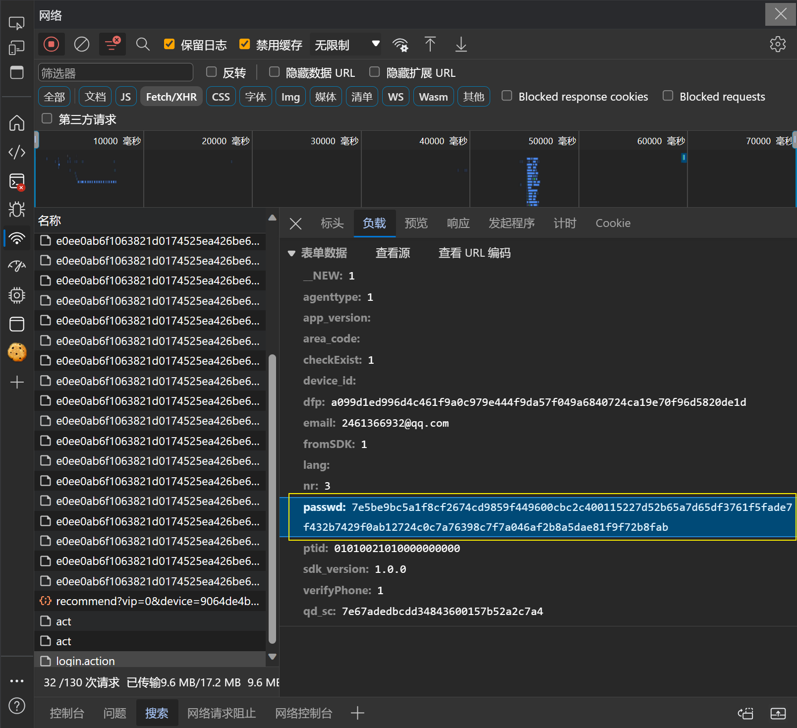

输入密码为：666

登录时对密码进行了加密

## 找到对应的js文件，添加断点

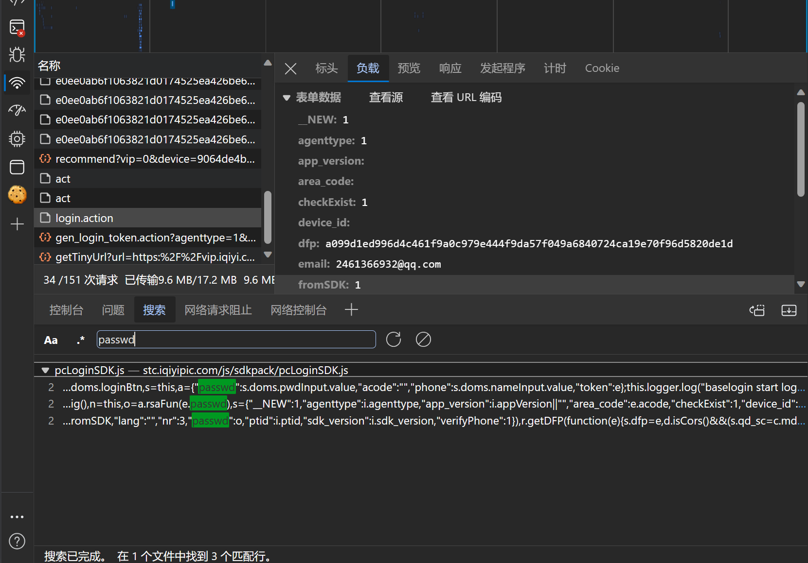

## 下完断点，重新登录

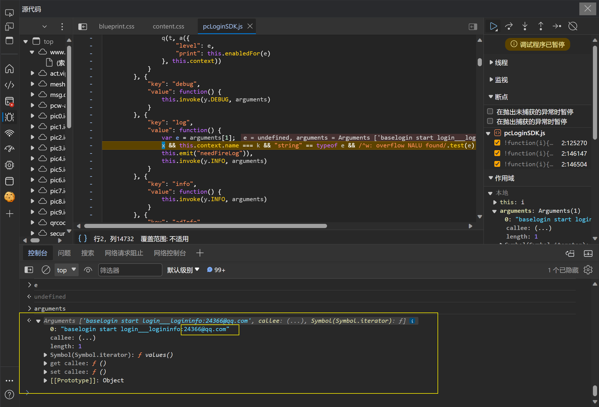

## 断点处看到了a变量

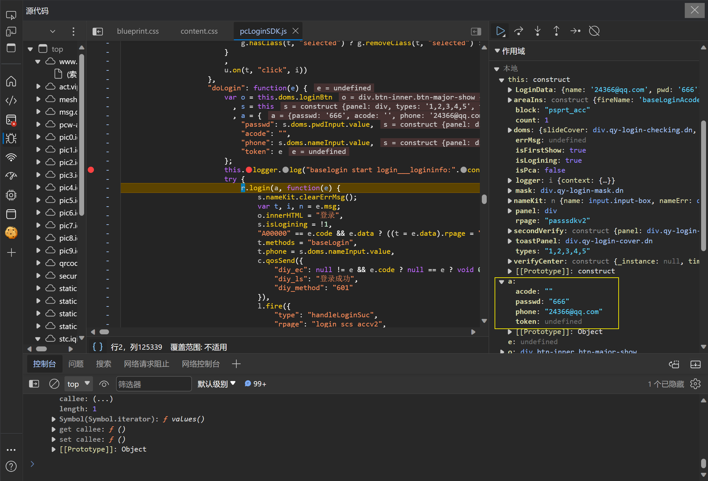

找到密码，其他断点可以删掉了，追踪这个a

这个函数复制出来，查看函数对a的处理逻辑

该函数运行完，加密字段就出现了，说明该函数对a进行了加密

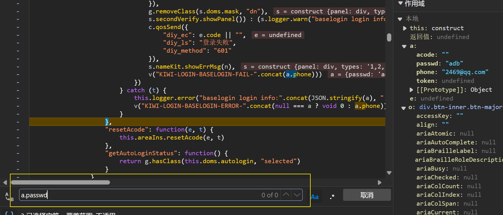

说明不是对密码进行单独操作，而是操作了整个a

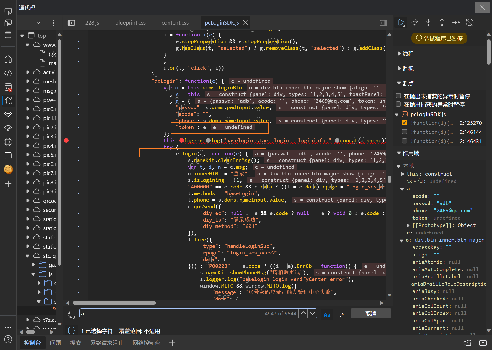

这里将a和e为参数的某个函数传递给了r.login函数执行登陆操作

## 代码解析

### **代码**

```js
r.login(a, function (e) {
            s.nameKit.clearErrMsg();
            var t, i, n = e.msg;
            o.innerHTML = "登录",
                s.isLogining = !1,
                "A00000" == e.code && e.data ? ((t = e.data).rpage = "login_scs_accv2",
                    t.methods = "baseLogin",
                    t.phone = s.doms.nameInput.value,
                    c.qosSend({
                        "diy_ec": null != e && e.code ? null == e ? void 0 : e.code : "",
                        "diy_ls": "登录成功",
                        "diy_method": "601"
                    }),
                    l.fire({
                        "type": "handleLoginSuc",
                        "rpage": "login_scs_accv2",
                        "data": t
                    })) : "P00223" == e.code ? ((i = a).ErrCb = function () {
                    s.nameKit.showPhoneMsg("请稍后重试"),
                        s.logger.log("baselogin login verifyCenter error"),
                    window.MITO && window.MITO.log({
                        "message": "账号密码登录：触发验证中心失败",
                        "data": {
                            "acode": null === a ? void 0 : a.acode,
                            "phone": null === a ? void 0 : a.phone
                        }
                    })
                }
                    ,
                    c.qosSend({
                        "diy_ec": null != e && e.code ? null == e ? void 0 : e.code : "",
                        "diy_ls": "开启滑动验证码",
                        "diy_method": "6011"
                    }),
                    s.logger.log("baselogin login start verifyCenter"),
                    s.verifyCenter.callSDK(e, i, function (e) {
                        e ? (c.qosSend({
                            "diy_ec": "",
                            "diy_ls": "滑动验证码验证成功",
                            "diy_method": "60111"
                        }),
                            s.doLogin(e)) : (c.qosSend({
                            "diy_ec": "",
                            "diy_ls": "滑动验证码验证失败",
                            "diy_method": "60112"
                        }),
                            g.addClass(s.doms.slideCover, "dn"),
                            g.addClass(s.doms.mask, "dn"),
                            s.nameKit.showPhoneMsg("请稍后重试"))
                    })) : "P00807" == e.code ? (s.logger.log("baselogin login Bind mobile phone number"),
                    c.qosSend({
                        "diy_ec": null != e && e.code ? null == e ? void 0 : e.code : "",
                        "diy_ls": "绑定手机",
                        "diy_method": "6012"
                    }),
                    l.fire({
                        "type": "toggleLoginTypes",
                        "data": {
                            "type": 5,
                            "rpage": "login_scs_acc"
                        }
                    }),
                    g.removeClass(s.mask, "dn")) : "P00159" === e.code || "P00908" == e.code ? (s.logger.log("baselogin login fail data.code=".concat(e.code, " (").concat("hrisk", ")")),
                    c.qosSend({
                        "diy_ec": e.code || "",
                        "diy_ls": "高危账号/设备锁",
                        "diy_method": "6013"
                    }),
                    i = "P00159" === e.code ? "hrisk" : "lock",
                    l.fire({
                        "type": "showQrCodeLogin",
                        "data": {
                            "type": i,
                            "mobile": n
                        }
                    }),
                    g.removeClass(s.doms.mask, "dn")) : "P00117" == e.code || "P00119" == e.code && n.indexOf("再错") < 0 || "P00125" == e.code && n.indexOf("再错") < 0 || "P00108" === e.code ? (s.count = s.count + 1,
                    2 <= s.count ? s.nameKit.showErrMsg("账号或密码错误，试试短信登录吧~") : s.nameKit.showErrMsg(n || "账号或密码错误"),
                    s.logger.log("baselogin login fail (password error)"),
                    c.qosSend({
                        "diy_ec": (null == e ? void 0 : e.code) || "",
                        "diy_ls": "登录失败",
                        "diy_method": "601"
                    })) : "P00141" == e.code || "P00119" == e.code && 0 <= n.indexOf("再错") || "P00125" == e.code && 0 <= n.indexOf("再错") ? (s.logger.log("baselogin login fail (password error)"),
                    c.qosSend({
                        "diy_ec": (null == e ? void 0 : e.code) || "",
                        "diy_ls": "登录失败",
                        "diy_method": "601"
                    }),
                    s.nameKit.showErrMsg(n)) : "P00950" == e.code || "P00951" == e.code ? (s.logger.log("baselogin login data.code=".concat(e.code, " init secondVerify page")),
                    c.qosSend({
                        "diy_ec": e.code || "",
                        "diy_ls": "二次验证",
                        "diy_method": "6015"
                    }),
                    s.secondVerify.init({
                        "prePanel": s.panel,
                        "data": e
                    }),
                    g.removeClass(s.doms.mask, "dn"),
                    s.secondVerify.showPanel()) : (s.logger.warn("baselogin login info:".concat(JSON.stringify(a), " failed:").concat(JSON.stringify(e))),
                    c.qosSend({
                        "diy_ec": e.code || "",
                        "diy_ls": "登录失败",
                        "diy_method": "601"
                    }),
                    s.nameKit.showErrMsg(n),
                    v("KIWI-LOGIN-BASELOGIN-FAIL-".concat(a.phone)))
        })
```

### **解析**

这段代码看起来是 JavaScript，主要是对登录操作的处理，以下是大致的解释：

1. **r.login(a, function(e) {...})**：这是一个登录函数，接受两个参数，一个是变量 **a**，另一个是回调函数。回调函数处理登录的响应数据 **e**。
2. 根据登录返回的 **e.code** 进行不同的操作：
   - **"A00000"**：表示登录成功，会执行一系列操作，包括记录登录成功的日志、触发登录成功事件等。
   - **"P00223"**：可能表示需要进行验证，执行验证相关的操作，比如滑动验证码验证。
   - 其他以 **"P00..."** 开头的代码可能表示不同的登录失败情况，针对不同的错误码执行不同的操作，如显示错误信息、触发特定事件、记录日志等。
3. 每个错误码都有相应的处理方式，例如：
   - **"P00807"** 可能表示需要绑定手机，触发绑定手机的操作。
   - **"P00159"** 可能表示高危账号或设备锁，展示对应的登录方式。
   - 其他错误码也有对应的处理，有些可能是密码错误、需要二次验证等情况。
4. 在处理过程中，会记录日志、触发事件、发送统计信息等。

总体来说，这段代码是一个登录功能的实现，根据不同的登录返回结果执行相应的操作，包括成功登录的处理、需要验证的处理、不同错误码的处理等。

### r.login()函数的执行顺序

在这个代码段中，r.login()函数是一个异步函数，因为它似乎在登录时会进行一系列的异步操作，比如向服务器发送请求，等待服务器响应等。JavaScript中的异步函数执行过程如下：

1. **触发登录操作：** 当调用r.login(a, function(e) {...})时，会触发登录操作，其中a是传递给登录函数的参数。
2. **执行登录函数：** r.login()函数内部会开始执行登录操作，可能包括网络请求、数据处理等异步任务。
3. **异步操作开始：** 登录函数内部可能有一系列异步操作，比如向服务器发送请求，等待服务器响应。这些操作会被放入事件循环队列中，继续执行下面的代码。
4. **继续执行后续代码：** r.login()函数执行后，会继续执行后续的同步代码，不会等待异步操作的完成。
5. **异步操作完成后的回调：** 当登录函数中的异步操作完成并且有了结果时，会触发回调函数(function(e) {...})。这个回调函数将处理登录操作的响应数据e。

因为JavaScript中的异步操作是非阻塞的，所以r.login()函数调用后会立即执行后续的代码，而不会等待登录操作的完成。登录操作完成后，会触发相应的回调函数来处理登录结果。

## 进入r.login代码

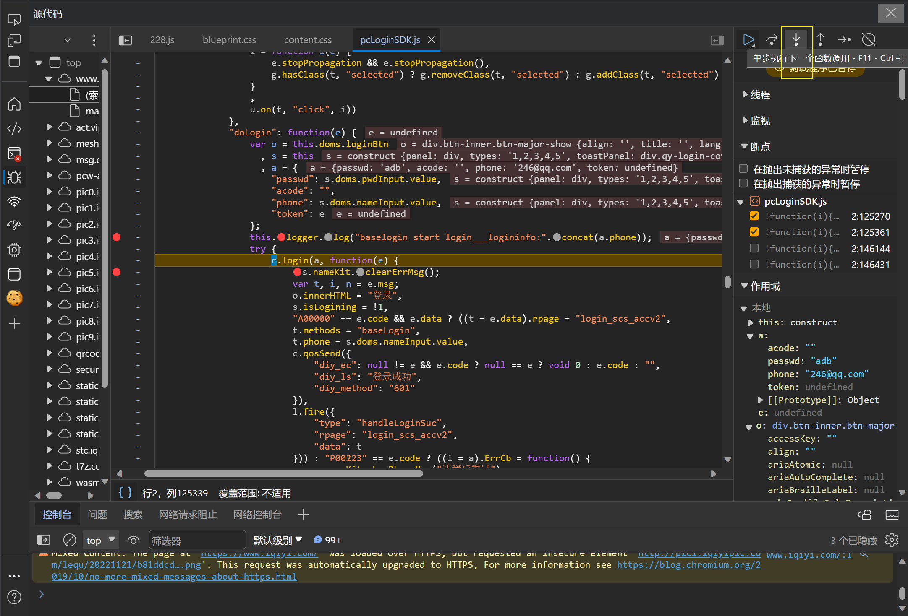

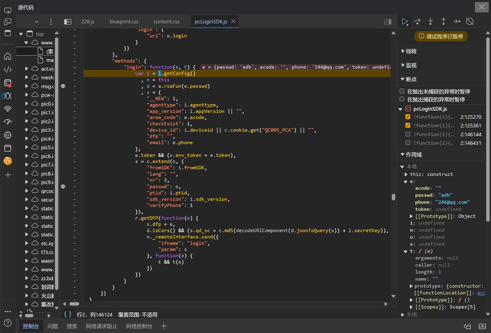

### 加密代码

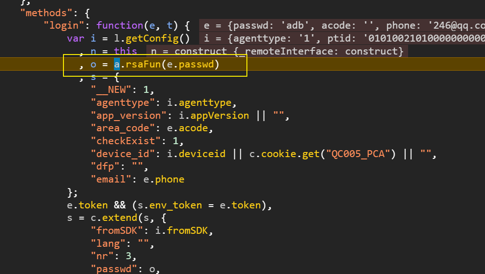

进入加密函数a.rsaFun(e.passwd)

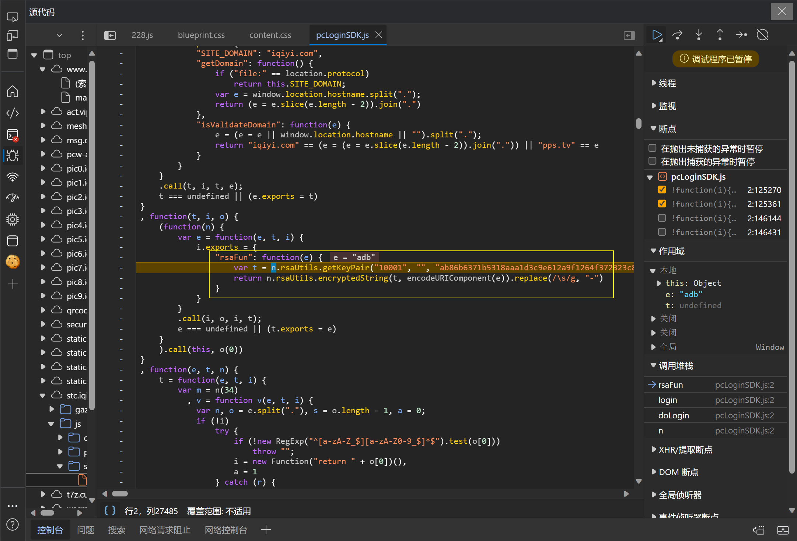

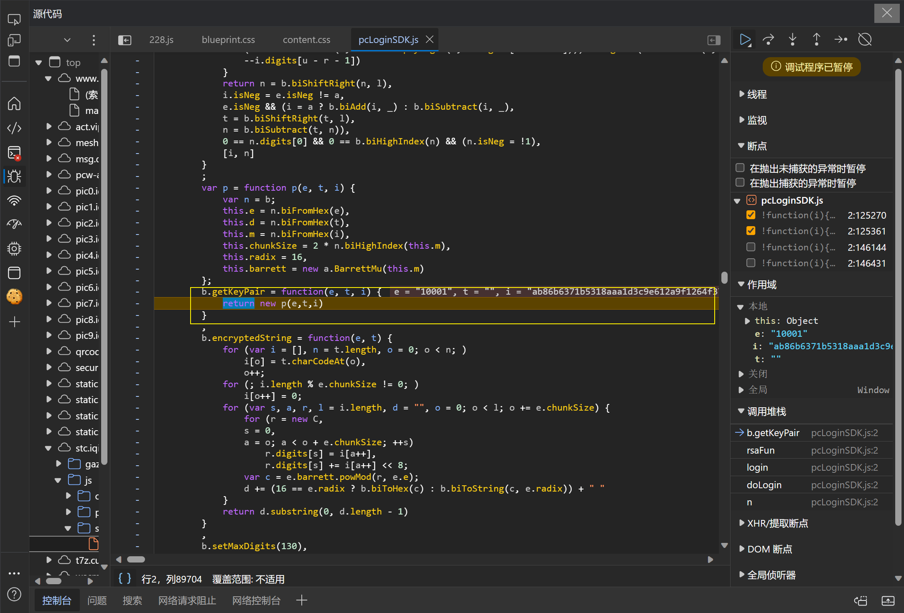

```js
b.biFromHex = function(e) {
            for (var t = new C, i = e.length, n = 0; 0 < i; i -= 4,
            ++n)
                t.digits[n] = b.hexToDigit(e.substr(Math.max(i - 4, 0), Math.min(i, 4)));
            return t
        }
```

这段代码定义了一个函数 `b.biFromHex()`，它似乎是用来将十六进制字符串转换为一个大整数对象。

让我们分解一下这个函数：

1. **函数参数：**
   - `e` 是一个十六进制字符串，作为输入参数。
2. **函数功能：**
   - 创建了一个新的大整数对象 `t`，通过调用之前提到的函数 `C`。
   - 使用一个循环将十六进制字符串 `e` 转换成一个大整数对象。
   - 在每次迭代中，从字符串 `e` 的末尾逐步取出四个字符（或少于四个字符），将其转换为一个数字并存储在大整数对象 `t` 的 `digits` 数组中的对应位置。这里用到了 `b.hexToDigit()` 函数来将十六进制字符转换为对应的数值。
3. **返回值：**
   - 返回转换后的大整数对象 `t`。

这段代码的作用是将输入的十六进制字符串转换成一个大整数对象，通过每四个字符一组的方式转换并存储到 `t` 对象的 `digits` 属性中，最终返回这个表示大整数的对象。

```js
C = function C(e) {
            this.digits = "boolean" == typeof e && !0 === e ? null : o.slice(0),
            this.isNeg = !1
        };
```


这段代码定义了一个函数 C，这个函数似乎是用于创建一个对象，具体是用于什么功能需要更多的上下文信息。这个函数包含了以下几个部分：

1. **构造函数：** 函数 C 接受一个参数 e。如果 e 是布尔类型且为 true，会将 digits 设为 null；否则，将 digits 设为一个名为 o 的数组的副本（slice(0)）。
2. **属性：**
   - **digits：** 这个属性可能是用于存储数字的数组。如果参数 e 是布尔类型且为 true，则 digits 被设置为 null。否则，会将 o 数组的副本存储在 digits 属性中。
   - **isNeg：** 这是一个布尔类型的属性，初始值为 false。可能用于标识数字是否为负数。

根据提供的代码，函数 C 似乎是用于创建一个数字对象，其中 digits 属性用于存储数字的数组表示形式，而 isNeg 属性用于标识这个数字对象是否为负数。