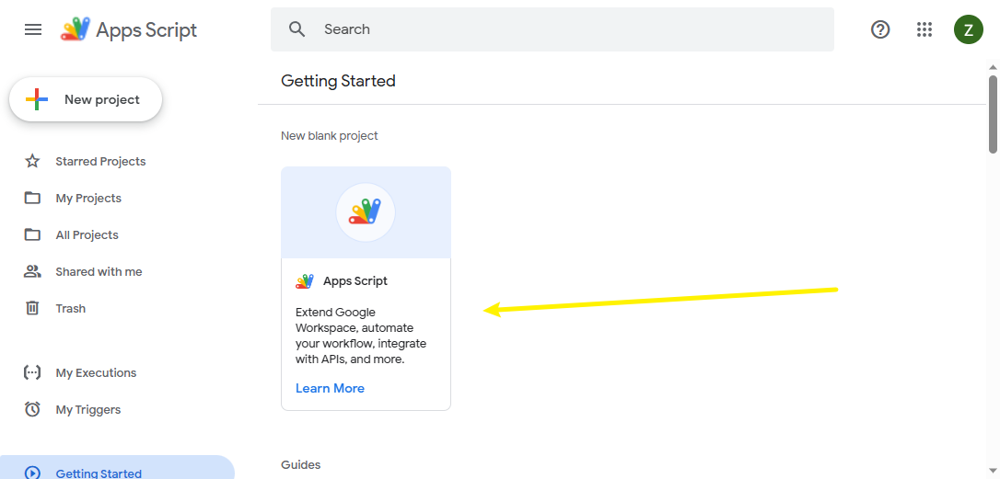
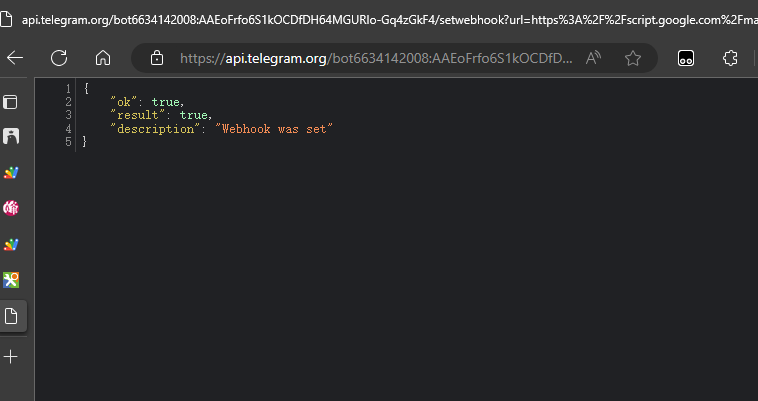
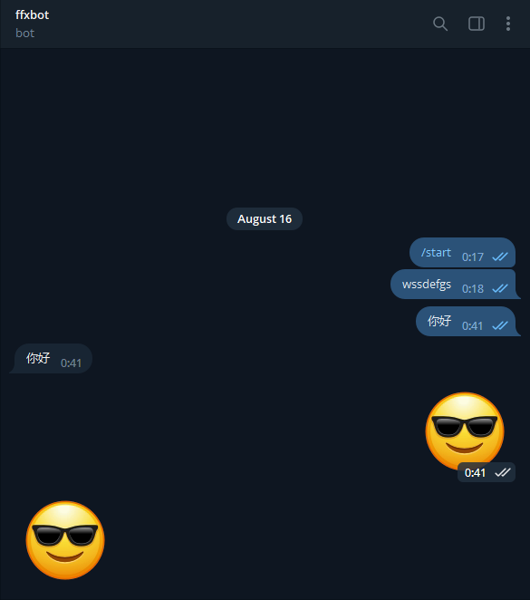
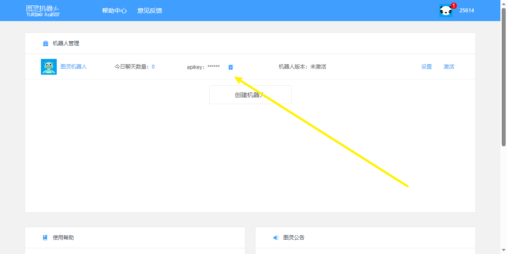

# telegrambot

## 创建机器人

## 回声机器人

### 编写脚本

打开google脚本编写网站：[Apps Script – Google Apps Script](https://www.google.com/script/start/)

创建新脚本，APP脚本



复制代码

```js
function doGet(e){
  return HtmlService.createHtmlOutput("Hello World!! No, this link should be hidden!!!");
}
 
 
function doPost(e){
  var dataFromTelegram = {
    "method": "post",
    "payload": e.postData.contents
  }
  var body = JSON.parse(e.postData.contents);
   
  body.message.chat.id = body.message.chat.id + '';
 
  var payload = preparePayload(body);
  var data = {
    "method": "post",
    "payload": payload
  }
   
  var dataToTelegram = {
    "method": "post",
    "payload": payload
  }
 
  UrlFetchApp.fetch("https://api.telegram.org/bot6634142****************64MGURlo-Gq4zGkF4/", data);
} // 将6634142****************64MGURlo-Gq4zGkF4替换成bot的token
function preparePayload(body){
  var payload;
   
  if (body.message.text){ // 处理文本文件
      payload = {
          "method": "sendMessage",
          "chat_id": body.message.chat.id,
          "text": body.message.text,
      } 
     
  }
  else if (body.message.sticker){ // 处理表情文件
    payload = {
      "method": "sendSticker",
      "chat_id": body.message.chat.id,
      "sticker": body.message.sticker.file_id
    }
   }
  else if (body.message.photo){ // 处理照片文件
    array = body.message.photo;
    text = array[1];
    payload = {
      "method": "sendPhoto",
      "chat_id": body.message.chat.id,
      "photo": text.file_id
    }
   }
    else {
    payload = {
      "method": "sendMessage",
      "chat_id": body.message.chat.id,
      "text": "Try other stuff"
    }
   }
  return payload
}
```

### 点击部署

找到网络应用程序，验证谷歌账户，绑定权限获取部署信息

部署成功返回url：https://script.google.com/macros/s/AKfycb*****************7wxfEEKhiMw/exec

使用url编码得到：https%3A%2F%2Fscript.google.com%2Fmacros%2Fs%2FAKfycb*****************7wxfEEKhiMw%2Fexec

拼接bothook链接：https://api.telegram.org/bot6634142****************64MGURlo-Gq4zGkF4/setwebhook?url=https%3A%2F%2Fscript.google.com%2Fmacros%2Fs%2FAKfycb*****************7wxfEEKhiMw%2Fexec

### 激活bothook

访问拼接的bothook链接，返回：



完成

### 测试效果



## 图灵机器人

### 申请账号

[图灵机器人-智能好用的AI对话机器人 (turingapi.com)](https://www.turingapi.com/)

注册登录，创建机器人



重要的是拿到apikey，不要添加密钥

### 编写代码

```js

```

https://script.google.com/macros/s/AKfycbynUyWgVoQyCsAxW2mrFk8icV4kS2nAYg0f6RYZdG-huXl7ZZ6ilpAH4Lrqz-_jM27E/exec

拼接bothook链接：https://api.telegram.org/bot6634142****************64MGURlo-Gq4zGkF4/setwebhook?url=https%3A%2F%2Fscript.google.com%2Fmacros%2Fs%2FAKfycb*****************7wxfEEKhiMw%2Fexec

## 简单机器人

```gas
// 真是对不起呀， 发布代码的时候我把doGet 给删除了，导致和视频里不一样， 现在加回去。。。
function doGet(e){
  return HtmlService.createHtmlOutput("Hello World!! No, this link should be hidden!!!");
}
 
 
function doPost(e){
  var dataFromTelegram = {
    "method": "post",
    "payload": e.postData.contents
  }
  var body = JSON.parse(e.postData.contents);
   
  body.message.chat.id = body.message.chat.id + '';
 
  var payload = preparePayload(body);
  var data = {
    "method": "post",
    "payload": payload
  }
   
  var dataToTelegram = {
    "method": "post",
    "payload": payload
  }
 
  UrlFetchApp.fetch("https://api.telegram.org/bot6634142008:AAEoFrfo6S1kOCDfDH64MGURlo-Gq4zGkF4/", data);
}
function preparePayload(body){
  var payload;
   
  if (body.message.text){
      payload = {
          "method": "sendMessage",
          "chat_id": body.message.chat.id,
          "text": body.message.text,
      } 
     
  }
  else if (body.message.sticker){
    payload = {
      "method": "sendSticker",
      "chat_id": body.message.chat.id,
      "sticker": body.message.sticker.file_id
    }
   }
  else if (body.message.photo){
    array = body.message.photo;
    text = array[1];
    payload = {
      "method": "sendPhoto",
      "chat_id": body.message.chat.id,
      "photo": text.file_id
    }
   }
    else {
    payload = {
      "method": "sendMessage",
      "chat_id": body.message.chat.id,
      "text": "Try other stuff"
    }
   }
  return payload
}
```

