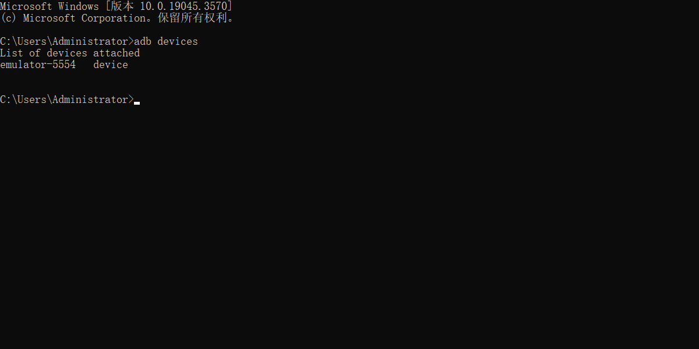
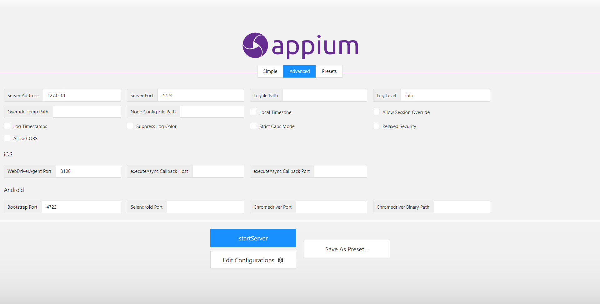
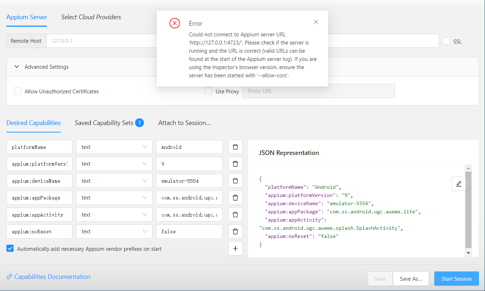
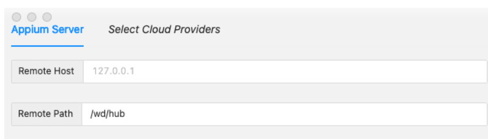

# appium

## 安装教程

[appium环境配置（史上最全详细）_appium安装及环境配置-CSDN博客](https://blog.csdn.net/u013302168/article/details/122475805)

[【k.11】python+appium+雷电模拟器 app自动化测试 demo 教学-CSDN博客](https://blog.csdn.net/u010442381/article/details/114479291)

[Appium+Python+雷电模拟器自动化测试 - hao_guo - 博客园 (cnblogs.com)](https://www.cnblogs.com/1527275083gj/p/15032138.html)

## 链接报错







### 解决

```bash
appium --base-path /wd/hub 
```



[如何找到要测试的apk的包名和主类名-CSDN博客](https://blog.csdn.net/zhangchaoy/article/details/42744485)

